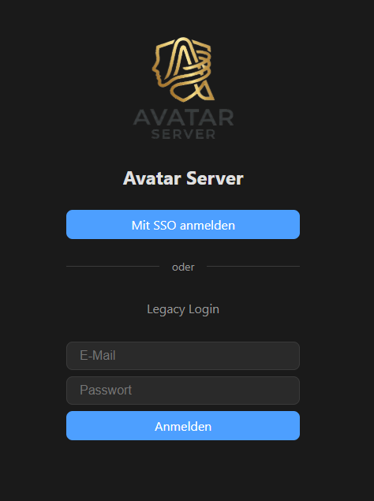
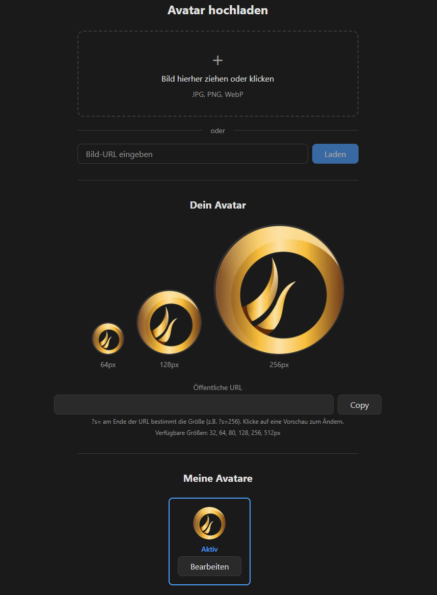
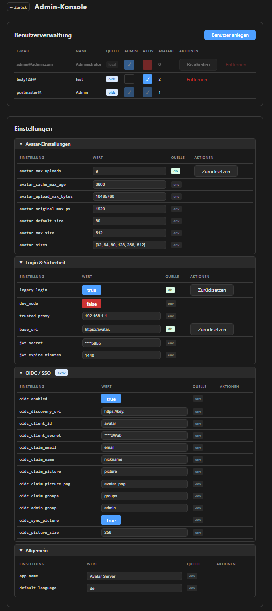
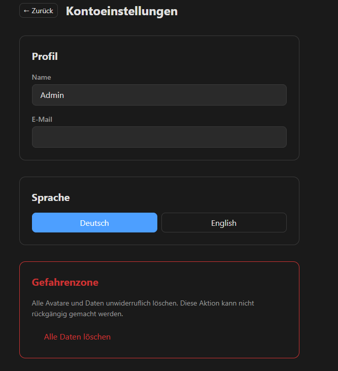

# Avatar Server

Self-Hosted Avatar Server — ein Gravatar-Ersatz für die eigene Infrastruktur. Stellt Profilbilder über eine öffentliche API bereit, gesichert durch OIDC/SSO oder lokale Authentifizierung.

## 📸 Screenshots

| Login | Startseite |
|:-----:|:----------:|
|  |  |

| Admin-Konsole | Kontoeinstellungen |
|:-------------:|:------------------:|
|  |  |

## ✨ Features

### Avatar-Verwaltung
- **Upload** — Drag & Drop, Datei-Auswahl oder URL-Import
- **Crop-Editor** — Kreis-Overlay mit Zoom und Verschieben
- **Bildverarbeitung** — EXIF-Korrektur, Resize in 6 Größen (32–512px), WebP-Format
- **Upload-Historie** — Alle Uploads gespeichert, Original bleibt erhalten, Recrop möglich
- **Vorschau** — Aktiver Avatar in 3 Größen mit öffentlicher URL zum Kopieren

### Öffentliche API
- `GET /avatar/{hash}?s=64` — Gravatar-kompatible API (WebP)
- `GET /avatar/{hash}.png?s=256` — PNG-Variante (on-the-fly Konvertierung)
- Erkennt MD5 und SHA256 automatisch
- Cache-Control Header konfigurierbar

### Authentifizierung
- **OIDC/SSO** — Generischer Authorization Code Flow (Keycloak, Authentik, Authelia, etc.)
- **Lokaler Login** — Email + Passwort als Fallback ("Legacy Login")
- **Konfigurierbare Claims** — email, nickname, picture, groups frei wählbar
- **Admin-Gruppen** — Admin-Rechte über IdP-Gruppen steuerbar
- **Picture-Sync** — Avatar-URL wird automatisch ans IdP zurückgeschrieben
- **JWT** — Bearer-Token mit konfigurierbarer Ablaufzeit

### Administration
- **Admin-Konsole** — Benutzerverwaltung, User Avatare, Settings als separate Tabs
- **Avatar sperren** — Admin kann einzelne Avatare sperren, nächster nicht-gesperrter wird automatisch aktiv, Silhouette als Fallback
- **Settings-Editor** — Alle Einstellungen zur Laufzeit änderbar (ENV als Defaults, DB-Overrides)
- **Admin-User aus ENV** — Wird beim ersten Start automatisch angelegt

### Sonstiges
- **Mehrsprachigkeit** — Deutsch/Englisch, erweiterbar
- **Dark/Light Mode** — Manueller Toggle, System-Preference als Default
- **Docker** — Multi-Stage Build, ein Container für alles
  - Fertiger Build auf [Docker Hub](https://hub.docker.com/r/bigul91/avatar-server)

## 🚀 Tech Stack

| Komponente | Technologie |
|------------|-------------|
| **Backend** | Python 3.14, FastAPI, SQLAlchemy, aiosqlite, Pillow |
| **Frontend** | React 19, TypeScript, Vite |
| **Datenbank** | SQLite |
| **Auth** | JWT, OIDC (authlib, python-jose) |
| **Container** | Docker (Multi-Stage: Node + Python) |

## 💻 Installation

### Docker Hub (schnellster Weg)

Fertiges Image von [Docker Hub](https://hub.docker.com/r/bigul91/avatar-server) verwenden:

```bash
# Konfiguration erstellen
curl -O https://raw.githubusercontent.com/BiguL91/Avatar-Server/main/.env.example
cp .env.example .env
# .env anpassen (BASE_URL, ADMIN_EMAIL, JWT_SECRET, ...)

# Starten (bestimmte Version oder latest)
docker run -d --name avatar-server \
  --env-file .env \
  -p 3010:8000 \
  -v avatar-data:/app/data \
  bigul91/avatar-server:latest
```

### Docker Compose (empfohlen)

```bash
# Repository klonen
git clone <repo-url>
cd avatarServer

# Konfiguration erstellen
cp .env.example .env
# .env anpassen (BASE_URL, ADMIN_EMAIL, JWT_SECRET, ...)

# Starten (mit fertigem Image)
docker compose up -d

# Oder: Selbst bauen und starten
docker compose up -d --build
```

Der Server läuft auf Port `8000`. Einen Reverse-Proxy (Nginx, Caddy, Traefik) davor für SSL.

> **Watchtower-Nutzer:** Das `:latest` Tag wird bei jedem Release aktualisiert. Für eine feste Version stattdessen z.B. `bigul91/avatar-server:0.1.1` verwenden.


## Support & Spenden ☕

Wenn Ihnen das Projekt gefällt und Sie die Entwicklung unterstützen möchten, können Sie mir gerne einen Kaffee spendieren: [ko-fi.com/bigul91](https://ko-fi.com/bigul91)

### Lokale Entwicklung

```bash
# Backend
cd backend
pip install -e .
uvicorn app.main:app --reload

# Frontend (zweites Terminal)
cd frontend
npm install
npm run dev
```

Frontend unter `http://localhost:5173`, Backend unter `http://localhost:8000`.

## ⚙️ Konfiguration

Alle Einstellungen über Umgebungsvariablen (`.env`) oder zur Laufzeit über die Admin-Konsole.
Die Admin-Konsole gruppiert die Einstellungen in aufklappbare Bereiche (Avatar, Login & Sicherheit, OIDC/SSO, Allgemein).

### Wichtigste Variablen

| Variable | Default | Beschreibung |
|----------|---------|-------------|
| `BASE_URL` | `http://localhost:8000` | Öffentliche URL des Servers |
| `ADMIN_EMAIL` | — | Email des Admin-Users |
| `ADMIN_PASSWORD` | — | Passwort des Admin-Users |
| `JWT_SECRET` | `dev-secret-change-me` | **Unbedingt ändern!** |
| `LEGACY_LOGIN` | `true` | Legacy-Login (Email + Passwort) aktivieren/deaktivieren |
| `TRUSTED_PROXY` | — | IP/Subnetz des Reverse-Proxy (z.B. `192.168.1.10` oder `192.168.1.0/24`) |
| `ALLOWED_HOSTS` | `localhost` | Erlaubte Host-Header, komma-separiert (z.B. `localhost,avatars.domain.de`) |
| `DEV_MODE` | `false` | Login ohne Passwort für Entwicklung |

### OIDC / SSO

| Variable | Default | Beschreibung |
|----------|---------|-------------|
| `OIDC_ENABLED` | `false` | OIDC-Login aktivieren |
| `OIDC_DISCOVERY_URL` | — | Basis-URL (z.B. `https://sso.domain.com/realms/myrealm`) |
| `OIDC_CLIENT_ID` | — | Client-ID |
| `OIDC_CLIENT_SECRET` | — | Client-Secret |
| `OIDC_CLAIM_EMAIL` | `email` | Claim für Email |
| `OIDC_CLAIM_NAME` | `nickname` | Claim für Anzeigename |
| `OIDC_CLAIM_GROUPS` | `groups` | Claim für Gruppen |
| `OIDC_ADMIN_GROUP` | `admin` | Gruppenname für Admin-Rechte |
| `OIDC_CLAIM_PICTURE` | `picture` | IdP-Attribut für Avatar-URL (WebP) |
| `OIDC_CLAIM_PICTURE_PNG` | `avatar_png` | IdP-Attribut für PNG-Avatar-URL |
| `OIDC_SYNC_PICTURE` | `false` | Avatar-URL an IdP zurückschreiben |
| `OIDC_PICTURE_SIZE` | `256` | Bildgröße für Picture-Sync |

### Avatar-Einstellungen

| Variable | Default | Beschreibung |
|----------|---------|-------------|
| `AVATAR_SIZES` | `[32,64,80,128,256,512]` | Verfügbare Größen |
| `AVATAR_MAX_UPLOADS` | `6` | Max. Avatare pro User |
| `AVATAR_UPLOAD_MAX_BYTES` | `10485760` | Max. Dateigröße (10 MB) |
| `AVATAR_CACHE_MAX_AGE` | `3600` | Cache-Dauer in Sekunden |
| `AVATAR_ACCESS` | `public` | `public` = frei erreichbar, `subnet` = nur aus erlaubten Subnetzen |
| `AVATAR_ALLOWED_SUBNETS` | — | Komma-separiert (z.B. `192.168.1.0/24,10.0.0.0/8`) |
| `AVATAR_USER_CAN_PUBLISH` | `false` | User kann Avatar eigenständig öffentlich freigeben |

## 🏗 Architektur

```
Browser → Reverse-Proxy (SSL) → Avatar Server (:8000)
                                    ├── /api/*      → FastAPI Backend
                                    ├── /avatar/*   → Öffentliche Avatar-API
                                    └── /*          → React SPA (statisch)

Avatar Server ←→ OIDC Provider (Keycloak, etc.)
                    ├── Login: Authorization Code Flow
                    ├── Logout: end_session_endpoint
                    └── Picture-Sync: Admin API (Service Account)
```

## 🔒 Security

- SSRF-Schutz auf Bild-Proxy (blockiert interne IPs, erfordert Auth)
- Path-Traversal-Schutz auf allen Datei-Endpoints
- Hash-Validierung (nur Hex-Zeichen)
- CORS mit spezifischen Origins/Methods
- Secrets in Admin-API maskiert
- Dev-Mode und Debug standardmäßig deaktiviert
- OIDC ohne HTTPS wird beim Start blockiert (verhindert unverschlüsselte Token-Übertragung)
- OIDC + Dev-Mode gleichzeitig wird beim Start und zur Laufzeit blockiert
- Trusted Proxy — optional nur Requests von bestimmter IP/Subnetz erlauben, X-Forwarded-For Support
- Allowed Hosts — Host-Header Restriction, blockiert Zugriffe über unbekannte Domains/IPs
- Avatar Access Control — Subnet-basierte Zugriffskontrolle für Avatare, eingeloggte User immer erlaubt (JWT-Auth)
- JWT-Secret Warnung wenn Default-Wert im Produktivbetrieb
- Validierung in der Admin-Konsole: OIDC erfordert HTTPS, Trusted Proxy und deaktivierten Dev-Mode

## 📋 Changelog

| Version | Datum | Highlights |
|---------|-------|------------|
| v0.1.5 | 2026-03-27 | Avatar sperren, Admin-Tab "User Avatare", Admin-Konsole Refactoring |
| v0.1.4 | 2026-03-25 | ALLOWED_HOSTS, Avatar Access Control (Subnet-Modus), Session-Persistenz |
| v0.1.3 | 2026-03-22 | App-Logo, Settings-Gruppen, JWT/App-Name konfigurierbar |
| v0.1.2 | 2026-03-22 | Trusted Proxy, OIDC Security Checks, X-Forwarded-For |
| v0.1.1 | 2026-03-22 | Legacy-Login Toggle, Docker Hub |
| v0.1.0 | 2026-03-21 | Initial Release |

**Vollständiger Changelog:** Siehe [CHANGELOG.md](CHANGELOG.md) für detaillierte Informationen.
